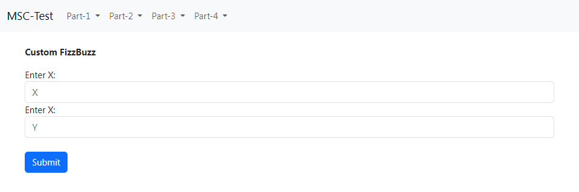

# Cách chạy dự án
- Thực thi lệnh `npm install` trong Terminal.
- Chạy dự án bằng dòng lệnh `npm start` trong Terminal.
- Truy cập đường dẫn [localhost:8080](localhost:8080/) ở browser để vào giao diện kiểm thử (bên dưới).

>Thành phần giao diện
- Thanh điều  hướng chứa các `Part` của bài TEST.
- Mỗi `Part` sẽ có dropdown của từng `problem`.
- Click vào `problem` để kiểm thử chức năng.